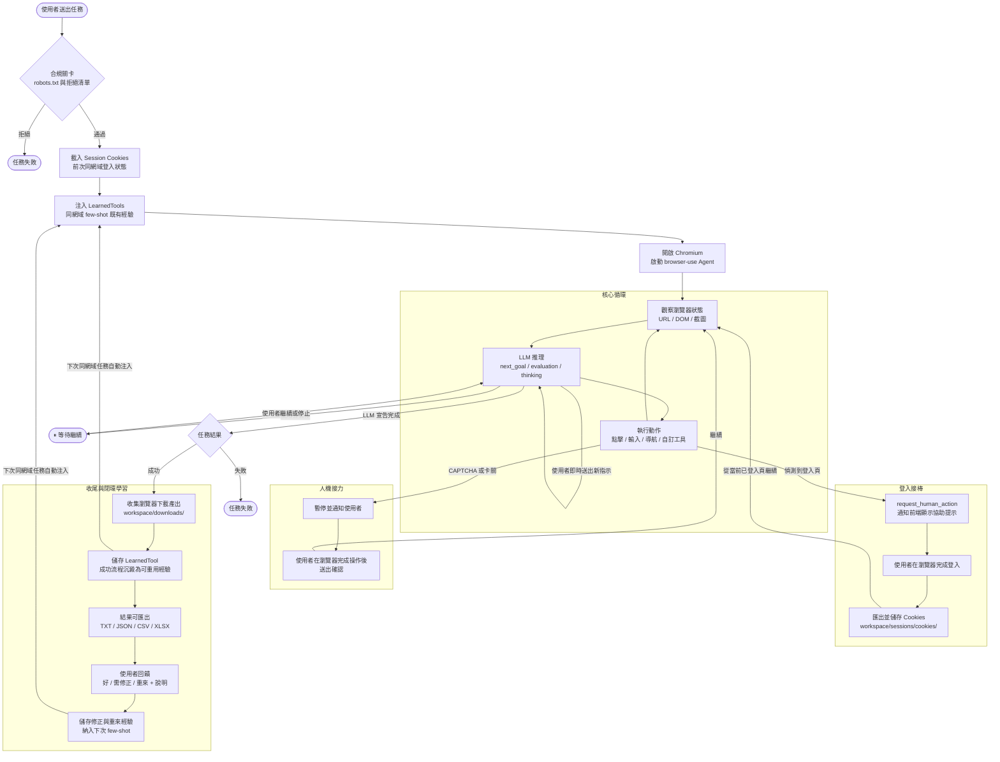

# wagent — 通用瀏覽器自動化 Agent 系統

用自然語言下達瀏覽器任務（例如「用 NotebookLM 生成簡報」「去某站抓某些資料」），由 AI agent
穩定驅動瀏覽器完成，產出**可驗證結果 + 完整執行日誌**。具備 HITL（人在迴路）回饋機制：
agent 卡關會問你、結果不好可給回饋、成功流程會沉澱成可重用經驗，下次更好。

- **核心引擎**：[browser-use](https://github.com/browser-use/browser-use)（透過 CDP 驅動 Chromium）
- **架構**：Clean Architecture 四層，依賴由外指向內
- **LLM 後端**：Anthropic Claude 或 OpenAI-compatible（env 切換）

## How it works



每個步驟的 LLM 推理摘要（`next_goal` / `evaluation` / `thinking`）即時串流到前端，讓你全程透明掌握 agent 的思路。

## 如何使用

### 1. 一次性安裝設定

```bash
uv sync                          # 安裝 Python 相依（需 Python 3.11、uv）
cp .env.example .env             # 填入 ANTHROPIC_API_KEY（或 OpenAI-compatible 金鑰）
```

### 2. 成品啟動（推薦）— 一行同時跑前端 + 後端

```bash
uv run python app.py
```

`app.py` 會：偵測前端是否已 build（未 build 則自動 `npm install` + `npm run build`）→
用 FastAPI 單一程序服務 React 前端與 API（單一 port）。完成後開瀏覽器：

> **http://localhost:8000** ← 完整網頁系統（API 文件在 `/docs`）

參數：`--host`（預設 127.0.0.1）、`--port`（預設 8000）、`--skip-build`（略過自動 build）。
首次啟動會自動建置前端，需要本機有 [Node.js](https://nodejs.org)。

### 3. 在網頁上操作

1. 左側填**指示**（自然語言）、可選**起始網址**與**欲抽取欄位** → 送出。
2. 右側即時看到 `running` 與**步驟串流**（SSE）。
   - 展開 **💭 推理過程**（每步 LLM 的 next_goal / evaluation / thinking）。
3. **即時轉向**：執行中可隨時送新指示改方向，或按**暫停 / 繼續 / 停止**。
4. 遇 CAPTCHA / **登入頁**會自動轉 `waiting_for_user`，在瀏覽器完成登入後輸入「已登入」送出續跑。
5. 結束看**結果**（可下載），並給**回饋**（好 / 需修正 / 重來）。
   - 若任務過程中觸發了瀏覽器下載，結果區會顯示 **📎 下載產出檔案**。
   - 結果可匯出：**TXT / JSON / CSV / XLSX**（結果為 JSON 陣列時 CSV/XLSX 可正確轉換）。

> 想看到真實瀏覽器視窗（例如手動過 CAPTCHA 或 Google 登入）：在 `.env` 設 `WAGENT_HEADLESS=false`。

### 開發模式（前端 hot reload，需開兩個終端機）

```bash
# 終端機 1：後端（支援 reload）
uv run uvicorn infrastructure.server:app --reload --port 8000
# 終端機 2：前端 dev server（vite，proxy 到 8000）
npm run dev --prefix frontend          # 開 http://localhost:5173
```

### 測試與檢查

```bash
uv run pytest                              # 單元 + 契約 + 整合（真實瀏覽器/E2E 預設 skip）
uv run lint-imports                        # 驗證 Clean Architecture 依賴方向
uv run python scripts/gen_repo_map.py --check        # repo map 是否最新

# （選用）真實瀏覽器 / 全棧 E2E（需金鑰、會開瀏覽器）
$env:WAGENT_RUN_REAL_BROWSER=1; uv run pytest tests/integration/test_browser_use_real.py
$env:WAGENT_RUN_E2E=1;          uv run pytest tests/e2e/test_full_stack.py
```

### 免金鑰示範（玩即時轉向，不開真實瀏覽器）

```bash
# 終端機 1：慢速假 agent 後端（任務維持 RUNNING 方便操作）
uv run uvicorn scripts.dev_fake_server:app --port 8000
# 終端機 2：前端
npm run dev --prefix frontend
```

## 資料夾結構

```
wagent/
├── app.py                    # 啟動入口（自動 build 前端 + 起 FastAPI）
├── domain/                   # 純邏輯：entities、value objects、ports 介面
├── application/              # Use cases（RunBrowserJob、SubmitTask…）
├── adapters/
│   ├── agents/               # BrowserUseGateway（實作 BrowserAgentPort）
│   ├── persistence/          # SQLModel repositories
│   └── web/                  # FastAPI routers、SSE
├── infrastructure/           # 框架組裝（browser-use、LLM、DB、DI 容器）
├── frontend/                 # React + Vite SPA
├── tests/                    # unit / contract / integration / e2e
├── scripts/                  # 工具腳本（gen_repo_map、dev_fake_server…）
├── workspace/                # 執行時產出（downloads/{job_id}/、sessions/cookies/）
└── docs/repo-map/            # 自動生成的 repo map（勿手改）
```

## API

| Method | Path | 說明 |
|---|---|---|
| `POST` | `/tasks` | 提交任務 `{instruction, start_url?, fields?}` → 背景執行，回 `{task_id, job_id}` |
| `GET` | `/tasks/{job_id}` | 查任務狀態、結果、步驟日誌 |
| `GET` | `/tasks/{job_id}/events` | **SSE** 即時串流事件（status / step / done） |
| `POST` | `/jobs/{job_id}/steer` | 即時轉向：送新指示 `{message}` |
| `POST` | `/jobs/{job_id}/pause` `/resume` `/stop` | 暫停 / 繼續 / 停止執行中的任務 |
| `POST` | `/jobs/{job_id}/answer` | 回答澄清 / 完成人機接力 `{answer}` → 續跑 |
| `POST` | `/jobs/{job_id}/followup` | 結束後追問：開承接前文的新任務 `{message}` |
| `POST` | `/jobs/{job_id}/feedback` | 結果回饋 `{rating: good\|edited\|rejected, note?}` |
| `POST` | `/credentials` | 安全提供帳密 `{site_domain, fields}`（不進日誌/LLM 原值） |
| `GET` | `/jobs/{job_id}/export/{fmt}` | 匯出結果：`fmt` = `txt` \| `json` \| `csv` \| `xlsx` |
| `GET` | `/jobs/{job_id}/artifacts/{filename}` | 下載任務過程中瀏覽器產生的檔案（PDF、mp3 等） |
| `GET` | `/health` | 健康檢查 |

### 對話 / 接棒 / 帳密（B4）
- **對話面板**：每個任務是一條對話時間軸 + 永遠在的輸入框；執行中送出=即時轉向、等待中=回答、**結束後=追問**（開承接前文的新任務）。
- **可配置接棒**：任務表單可選「遇驗證/登入時」的策略（`ai_then_human` 預設 / `human_first` / `ai_only`），或用 `.env` 設全域預設。
- **安全帳密**：等待協助時可開帳密表單提供帳號密碼 → 以 browser-use `sensitive_data` 注入（**LLM 不見原值、網域綁定、不寫日誌**）。

### AI 推理、登入接棒、產出下載（C1/C2/C3）
- **💭 推理過程串流（C1）**：每個 agent 步驟的 `next_goal`（下一步計畫）、`evaluation`（對上步評估）、`thinking`（擴展思考，模型支援時）即時串流到對話泡泡，可展開查看。
- **主動式登入偵測（C2）**：agent 停在 Google / Microsoft 等登入頁時自動暫停，通知使用者在已開啟的瀏覽器完成登入後，輸入「已登入」讓任務繼續。需 `WAGENT_HEADLESS=false`。
- **瀏覽器下載檔案（C3）**：任務執行中觸發的下載（PDF、mp3、xlsx…）存入 `workspace/downloads/{job_id}/`，任務完成後在結果區顯示 **📎 下載** 按鈕。

### 結果匯出（B5）
任務成功後，結果區提供四種下載格式：
| 格式 | 說明 |
|---|---|
| **TXT** | 純文字，永遠可用 |
| **JSON** | 若結果本身是 JSON 則直接輸出；否則包成 `{"result": "..."}` |
| **CSV** | 結果為 JSON 陣列的物件時自動轉換；否則純文字 fallback |
| **XLSX** | 結果為 JSON 陣列的物件時輸出 Excel；否則回 422 |

## 合規與安全

執行任務前會自動做合規檢查（可在 `.env` 調整）：
- **robots.txt**：不允許抓取的目標會被擋下，任務標記 `failed`（`WAGENT_RESPECT_ROBOTS=false` 可關閉）。
- **拒絕清單**：`WAGENT_COMPLIANCE_DENYLIST` 列出的網域（含子網域）一律拒跑。
- **禮貌節流**：同網域任務維持最小間隔 `WAGENT_MIN_DOMAIN_INTERVAL_SEC`（預設 2 秒），避免對目標站造成負擔。

> **個資（PII）提醒**：系統**不會自動竄改你抓取的資料**（那可能正是你要的內容）。
> 但請自負法律/服務條款責任：勿用於未授權的個資蒐集；敏感輸入不要寫進共用日誌。